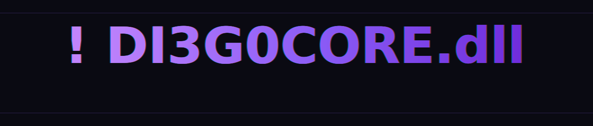

# <span style="color:#00ff9d;"># DI3G0C0RE.dll</span>

<div align="center">
  
</div>

<div align="center">
  
  
  
  
  
</div>

<div align="center">
  <h3>Desarrollador FiveM Lead Dev · Automations & Tools</h3>
</div>

## <span style="color:#00ff9d;">👨‍💻 Sobre Mí</span>

```lua

Citizen.CreateThread(function()
    local d3c = {
        tag   = "! DI3G0C0RE.dll",
        title = "Desarrollador FiveM • Full Stack",
        summary = "Desarrollo sistemas para servidores FiveM, automatizo comunidades en Discord y preparo packs de ropa listos para integrarse.",
        skills = { "Lua", "JavaScript", "Discord API", "QBCore", "ESX", "SQL" },

        services = {
            development = {
                "Implementación de Jobs creator y drug system con lógica optimizada en Lua",
                "Integración de UI y menús de usuario basados en HTML/CSS/JS",
                "Automatizaciones y bots para Discord conectados vía API y eventos",
                "Traducir ideas de gameplay en scripts robustos y mantenibles",
                "Fomentar el crecimiento de servidores RP mediante contenido modular"
            },

            clothing = {
                description = "Agrupo y preparo packs de ropa existentes (EUP / MP), recolor, presets por género y tiendas integradas listas para producción.",
                integrations = { "illenium-appearance", "rcore-clothing" }
            },

            operations = {
                "Optimización del servidor y la base de datos (profiling, índices, caching)",
                "Revisión de rendimiento en entornos OneSync y monitoreo continuo",
                "Soporte técnico y despliegues controlados con documentación"
            }
        },

        focus = "Crear soluciones listas para usar y fáciles de instalar"
    }

    while true do
        Wait(0)
    end
end)

```


## <span style="color:#00ff9d;">🚀 Actualidad</span>

- 🔧 Actualmente desarrollo, configuro y optimizo servidores **FiveM** a medida, desde la infraestructura hasta paquetes de ropa.
- 🛒 Ofrezco paquetes listos para lanzar (pquetes de ropa, scripts compatibles con diferentes frameworks, bots de discord enfocados al RP) y servicios de mantenimiento continuo para comunidades que quieren crecer sin preocuparse del backend.
- 🤝 ¿Buscas un servidor único o necesitas soporte para el tuyo? Estaré encantado de ayudarte.

<div align="center" style="margin-top:12px;">

[](https://tuservidor_enlace.com)
[](https://discord.gg/Gmpt8RcgCB)

</div>

## <span style="color:#00ff9d;">🛠️ Tecnologías & Herramientas</span>

<div align="center">

| FiveM | Lenguajes | Discord Bots & Tiempo Real | Bases de Datos | Herramientas |
| --- | --- | --- | --- | --- |
| • ESX Framework<br>• QBCore Framework<br>• OneSync<br>• FXServer<br>• NUI Development | • Lua<br>• JavaScript / TypeScript<br>• HTML / CSS<br>• **Python**<br>• SQL<br>• Node.js<br>• React | • discord.js (Node.js)<br>• PyCord / discord.py (Python)<br>• WebSockets<br>• REST APIs<br>• OAuth2<br>• Event-driven Architectures | • MySQL<br>• MariaDB<br>• MongoDB<br>• PostgreSQL<br>• SQLite<br>• Redis | • Git & GitHub<br>• VS Code<br>• Sublime Text<br>• Docker<br>• txAdmin<br>• PM2 / Supervisor |

</div>

## <span style="color:#00ff9d;">📬 Contacto</span>

<div align="center">

[](https://github.com/DI3G0C0REdll)
[](mailto:prismacore@outlook.com)
[](https://discord.gg/Gmpt8RcgCB)

</div>

