# <span style="color:#00ff9d;"># DI3G0C0RE.dll</span>

<div align="center">
  
</div>

<div align="center">
  
  
  
  
  
</div>

<div align="center">
  <h3>Desarrollador FiveM & Full Stack</h3>
</div>

## <span style="color:#00ff9d;">👨‍💻 Sobre Mí</span>

```lua
Citizen.CreateThread(function()
    local developer = {
        name = "! 𝐃𝐈𝟑𝐆𝟎𝐂𝟎𝐑𝐄.𝐝𝐥𝐥",
        role = "FiveM & Full Stack Developer",
        skills = {
            "Lua", "JavaScript", "HTML/CSS",
            "ESX Framework", "QBCore",
            "OneSync", "Server Optimization"
        },
        passion = "Construir experiencias de roleplay inmersivas",
        current_focus = "Sistemas económicos avanzados y frameworks de jobs"
    }

    while true do
        ImproveSkills(developer)
        CreateAwesomeScripts(developer)
        Wait(0)
    end
end)
```
## <span style="color:#00ff9d;">🛠️ Tecnologías & Herramientas</span>

<div align="center">

| FiveM | Lenguajes | Bases de Datos | Herramientas |
| --- | --- | --- | --- |
| • ESX Framework<br>• QBCore Framework<br>• vRP Framework<br>• OneSync<br>• FXServer<br>• NUI Development | • Lua<br>• JavaScript<br>• HTML/CSS<br>• SQL<br>• Node.js<br>• React | • MySQL<br>• MongoDB<br>• SQLite<br>• Redis | • Git<br>• VS Code<br>• Xdebug<br>• Docker<br>• txAdmin<br>• Postman |

</div>

## <span style="color:#00ff9d;">📬 Contacto</span>

<div align="center">

[](https://github.com/DI3G0C0REdll)
[](mailto:prismacore@outlook.com)
[](https://discord.gg/Gmpt8RcgCB)

</div>

